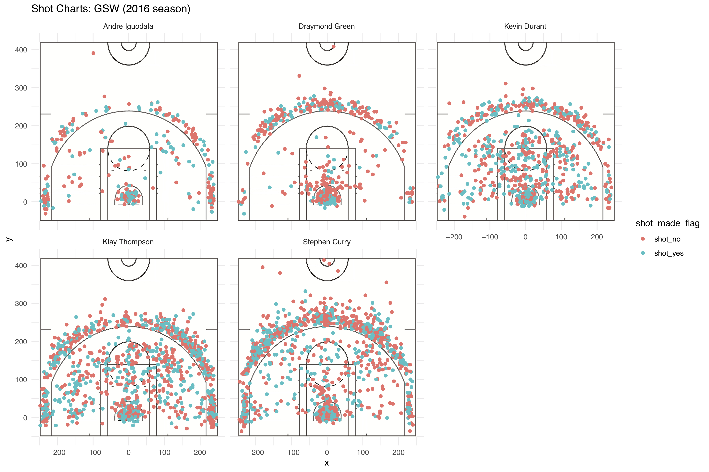

Work Out 1
================
Anni Chai

The NBA’s influence on the game of basketball has been no short of significance. The NBA has become a synynom for basketball. It has shaped basketball into one of the most popular sports on this planet. With the rise of expososure of the NBA and the flow of money in this industrty, data analytics, one of the biggest game changers in the NBA history, has become the driving force behind many decisions, including strategies, trading, predictions, and many more.

We are going to take a look at five of the most legendary players who played in the 2016 season: Draymond Green, Andre Iguodala, Kevin Durant, Klay Thompson, Stephen Curry. We will visualize some key data related to their success, and hopefully find a pattern, or perhaps a formula, to their successes.

First, We will take a look at the 2 point field goal effective shooting percentage by player. The column 'total' stands for how many 2 point attempts each player made during the season, and 'made' represents the actual shots that have scored. The column 'perc\_made' stands for the percentage of 2 point shots that were effective.

    ## Joining, by = "name"

    ## # A tibble: 5 x 4
    ##   name           total  made perc_made
    ##   <chr>          <int> <int>     <dbl>
    ## 1 Andre Iguodala   210   134      63.8
    ## 2 Kevin Durant     643   390      60.7
    ## 3 Stephen Curry    563   304      54.0
    ## 4 Klay Thompson    640   329      51.4
    ## 5 Draymond Green   346   171      49.4

Next, We will a look at the 3 point field goal effective shooting percentage by player.Here, the column 'perc\_made' stands for the percentage of 3 point shots that were effective. As you can see, Kevin Durant was significantly better at 3 points shots than all the other players.

    ## Joining, by = "name"

    ## # A tibble: 5 x 4
    ##   name           total  made perc_made
    ##   <chr>          <int> <int>     <dbl>
    ## 1 Kevin Durant     272   232      85.3
    ## 2 Draymond Green   232   117      50.4
    ## 3 Klay Thompson    580   256      44.1
    ## 4 Andre Iguodala   161    68      42.2
    ## 5 Stephen Curry    687   250      36.4

Then we have the effective total shooting percent for these five players. Kevin Durant seems to have the highest accuracy out of all these players. Though Andre Iguodala came in second place, ahead of Klay Thompson and Stephen Curry, he made only a quarter as many attempts as the other two. During the season, Klay Thompson and Stephen Curry each made over 500 shots for their teams, ahead of everyone else.

    ## Joining, by = "name"

    ## # A tibble: 5 x 4
    ##   name            made total perc_made
    ##   <chr>          <int> <int>     <dbl>
    ## 1 Kevin Durant     495   915      54.1
    ## 2 Andre Iguodala   192   371      51.8
    ## 3 Klay Thompson    575  1220      47.1
    ## 4 Stephen Curry    584  1250      46.7
    ## 5 Draymond Green   245   578      42.4

Now, let's look at the player's positions in comparison to their accuracy. Andre Iguodala seems to have roughly the same effectiveness with three pointers and two pointers. Draymond Green has the highest density of red in his chart. If you look at the chart above, he does, indeed, have the lowest shot effectiveness out of all five players. Kevin Durant, Klay Thompson, and Stephen Curry's charts has a very high sensity of blue as well as red, indicating that he made many attempts duing the season. Interestingly, Stephen Curry often attemped to score from behind the midlin, and a few of them were effective. 
